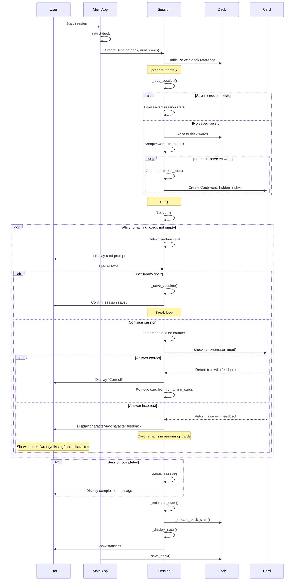

# Session Sequence Diagram

The following diagram illustrates the sequence of interactions during a study session in the English Word Memorization Application.

## Key Interactions in the Sequence

1. **Session Initialization**:
   - User selects to start a session through the main application
   - The application creates a Session object with the selected deck
   - Session initializes with a reference to the deck

2. **Card Preparation**:
   - Session attempts to load a previous session from a JSON file
   - If no saved session exists, it selects words from the deck and creates cards
   - Each card is created with a random syllable to hide

3. **Session Execution**:
   - The user is presented with cards one at a time in random order
   - For each card, the user inputs an answer or can choose to exit
   - The system checks the answer character by character and provides detailed feedback:
     - Correct characters shown in green
     - Wrong characters shown in red
     - Extra characters shown in yellow
     - Missing characters shown as blue underscores
   - Correct answers remove the card from rotation
   - Incorrect answers keep the card in rotation
   - If the user chooses to exit, the session state is saved

4. **Session Completion**:
   - When all cards are answered correctly, the session is complete
   - Session statistics are calculated and displayed to the user
   - The deck's statistics are updated with the session results

5. **Session State Management**:
   - The session can be saved and resumed later
   - Completed sessions are deleted from storage